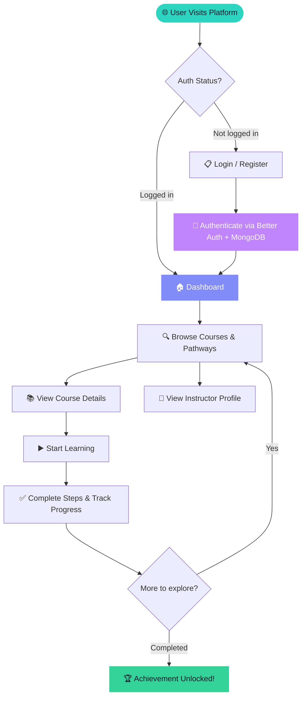

<div align="center">

<!-- Typing animation via external service (GitHub safe) -->


<br/>

<!-- Animated SVG Banner — SMIL only, GitHub-compatible -->
<svg width="860" height="200" viewBox="0 0 860 200" xmlns="http://www.w3.org/2000/svg">
  <defs>
    <linearGradient id="bg" x1="0" y1="0" x2="1" y2="1">
      <stop offset="0%" stop-color="#0D1117"/>
      <stop offset="100%" stop-color="#161B22"/>
    </linearGradient>
    <linearGradient id="grad1" x1="0" y1="0" x2="1" y2="0">
      <stop offset="0%" stop-color="#2DD4BF"/>
      <stop offset="50%" stop-color="#818CF8"/>
      <stop offset="100%" stop-color="#C084FC"/>
    </linearGradient>
    <linearGradient id="teal" x1="0" y1="0" x2="0" y2="1">
      <stop offset="0%" stop-color="#2DD4BF"/>
      <stop offset="100%" stop-color="#0D9488"/>
    </linearGradient>
    <linearGradient id="indigo" x1="0" y1="0" x2="0" y2="1">
      <stop offset="0%" stop-color="#A5B4FC"/>
      <stop offset="100%" stop-color="#6366F1"/>
    </linearGradient>
    <linearGradient id="purple" x1="0" y1="0" x2="0" y2="1">
      <stop offset="0%" stop-color="#E879F9"/>
      <stop offset="100%" stop-color="#A855F7"/>
    </linearGradient>
    <linearGradient id="green" x1="0" y1="0" x2="0" y2="1">
      <stop offset="0%" stop-color="#6EE7B7"/>
      <stop offset="100%" stop-color="#10B981"/>
    </linearGradient>
  </defs>

  <!-- Background -->
  <rect width="860" height="200" rx="16" fill="url(#bg)"/>

  <!-- Subtle grid -->
  <line x1="0" y1="50" x2="860" y2="50" stroke="#21262D" stroke-width="1"/>
  <line x1="0" y1="100" x2="860" y2="100" stroke="#21262D" stroke-width="1"/>
  <line x1="0" y1="150" x2="860" y2="150" stroke="#21262D" stroke-width="1"/>
  <line x1="215" y1="0" x2="215" y2="200" stroke="#21262D" stroke-width="1"/>
  <line x1="430" y1="0" x2="430" y2="200" stroke="#21262D" stroke-width="1"/>
  <line x1="645" y1="0" x2="645" y2="200" stroke="#21262D" stroke-width="1"/>

  <!-- NODE 1: Discover -->
  <circle cx="108" cy="100" r="38" fill="#2DD4BF" fill-opacity="0.08">
    <animate attributeName="r" values="38;44;38" dur="3s" repeatCount="indefinite"/>
    <animate attributeName="fill-opacity" values="0.08;0.16;0.08" dur="3s" repeatCount="indefinite"/>
  </circle>
  <circle cx="108" cy="100" r="22" fill="url(#teal)">
    <animate attributeName="cy" values="100;93;100" dur="3s" repeatCount="indefinite"/>
  </circle>
  <text x="108" y="104" text-anchor="middle" font-size="16" font-family="sans-serif">
    <animate attributeName="y" values="104;97;104" dur="3s" repeatCount="indefinite"/>
    🔍
  </text>
  <text x="108" y="140" text-anchor="middle" font-size="10" fill="#2DD4BF" font-family="sans-serif" font-weight="700" letter-spacing="1.5">DISCOVER</text>

  <!-- NODE 2: Learn -->
  <circle cx="322" cy="70" r="34" fill="#818CF8" fill-opacity="0.08">
    <animate attributeName="r" values="34;40;34" dur="3.4s" repeatCount="indefinite" begin="0.4s"/>
    <animate attributeName="fill-opacity" values="0.08;0.16;0.08" dur="3.4s" repeatCount="indefinite" begin="0.4s"/>
  </circle>
  <circle cx="322" cy="70" r="20" fill="url(#indigo)">
    <animate attributeName="cy" values="70;63;70" dur="3.4s" repeatCount="indefinite" begin="0.4s"/>
  </circle>
  <text x="322" y="74" text-anchor="middle" font-size="14" font-family="sans-serif">
    <animate attributeName="y" values="74;67;74" dur="3.4s" repeatCount="indefinite" begin="0.4s"/>
    📚
  </text>
  <text x="322" y="108" text-anchor="middle" font-size="10" fill="#818CF8" font-family="sans-serif" font-weight="700" letter-spacing="1.5">LEARN</text>

  <!-- NODE 3: Practice -->
  <circle cx="538" cy="130" r="34" fill="#C084FC" fill-opacity="0.08">
    <animate attributeName="r" values="34;40;34" dur="2.8s" repeatCount="indefinite" begin="0.8s"/>
    <animate attributeName="fill-opacity" values="0.08;0.16;0.08" dur="2.8s" repeatCount="indefinite" begin="0.8s"/>
  </circle>
  <circle cx="538" cy="130" r="20" fill="url(#purple)">
    <animate attributeName="cy" values="130;122;130" dur="2.8s" repeatCount="indefinite" begin="0.8s"/>
  </circle>
  <text x="538" y="134" text-anchor="middle" font-size="14" font-family="sans-serif">
    <animate attributeName="y" values="134;126;134" dur="2.8s" repeatCount="indefinite" begin="0.8s"/>
    ⚡
  </text>
  <text x="538" y="168" text-anchor="middle" font-size="10" fill="#C084FC" font-family="sans-serif" font-weight="700" letter-spacing="1.5">PRACTICE</text>

  <!-- NODE 4: Improve -->
  <circle cx="752" cy="100" r="38" fill="#34D399" fill-opacity="0.08">
    <animate attributeName="r" values="38;44;38" dur="3.2s" repeatCount="indefinite" begin="0.2s"/>
    <animate attributeName="fill-opacity" values="0.08;0.16;0.08" dur="3.2s" repeatCount="indefinite" begin="0.2s"/>
  </circle>
  <circle cx="752" cy="100" r="22" fill="url(#green)">
    <animate attributeName="cy" values="100;93;100" dur="3.2s" repeatCount="indefinite" begin="0.2s"/>
  </circle>
  <text x="752" y="104" text-anchor="middle" font-size="16" font-family="sans-serif">
    <animate attributeName="y" values="104;97;104" dur="3.2s" repeatCount="indefinite" begin="0.2s"/>
    🏆
  </text>
  <text x="752" y="140" text-anchor="middle" font-size="10" fill="#34D399" font-family="sans-serif" font-weight="700" letter-spacing="1.5">IMPROVE</text>

  <!-- Path lines (static dashed) -->
  <path d="M 130 96 Q 210 60 302 68" fill="none" stroke="#2DD4BF" stroke-width="1.5" stroke-opacity="0.3" stroke-dasharray="5 6"/>
  <path d="M 342 76 Q 430 110 518 128" fill="none" stroke="#818CF8" stroke-width="1.5" stroke-opacity="0.3" stroke-dasharray="5 6"/>
  <path d="M 558 126 Q 645 110 730 100" fill="none" stroke="#C084FC" stroke-width="1.5" stroke-opacity="0.3" stroke-dasharray="5 6"/>

  <!-- Travelling dot: Discover → Learn -->
  <circle r="5" fill="#2DD4BF">
    <animateMotion dur="2.2s" repeatCount="indefinite" begin="0s" path="M 130 96 Q 210 60 302 68"/>
    <animate attributeName="opacity" values="0;1;1;0" dur="2.2s" repeatCount="indefinite"/>
  </circle>

  <!-- Travelling dot: Learn → Practice -->
  <circle r="5" fill="#818CF8">
    <animateMotion dur="2.4s" repeatCount="indefinite" begin="0.8s" path="M 342 76 Q 430 110 518 128"/>
    <animate attributeName="opacity" values="0;1;1;0" dur="2.4s" repeatCount="indefinite" begin="0.8s"/>
  </circle>

  <!-- Travelling dot: Practice → Improve -->
  <circle r="5" fill="#C084FC">
    <animateMotion dur="2.2s" repeatCount="indefinite" begin="1.6s" path="M 558 126 Q 645 110 730 100"/>
    <animate attributeName="opacity" values="0;1;1;0" dur="2.2s" repeatCount="indefinite" begin="1.6s"/>
  </circle>

  <!-- Bottom accent bar -->
  <rect x="50" y="186" width="760" height="3" rx="2" fill="url(#grad1)">
    <animate attributeName="fill-opacity" values="0.4;0.9;0.4" dur="3s" repeatCount="indefinite"/>
  </rect>
</svg>

<br/>

<p>
  
  
  
  
  
  
  
  
</p>

<p>
  
  
  
  
</p>

</div>

---

## 📖 About

**SkillSphare** is a modern, full-stack online learning platform where learners can explore curated learning paths, browse detailed course catalogs, discover skilled instructors, and track their progress — all wrapped in a smooth, animated interface.

Built with the latest Next.js App Router, styled with Tailwind CSS v4, and animated with Framer Motion, SkillSphare is designed to feel as great as it looks.

---

## ✨ Features

<div align="center">

| 🎯 Core | 🎨 Design | 🔐 Auth & Data |
|:---:|:---:|:---:|
| Course catalog & browsing | Framer Motion animations | MongoDB-backed authentication |
| Curated learning pathways | Fully responsive (mobile-first) | Session management via Better Auth |
| Instructor profile cards | Dark / Light theme support | Secure Next.js API routes |
| Progress tracking dashboard | Smooth page transitions | Mongo adapter for user data |
| Step-by-step course flow | HeroUI component library | Environment-based config |

</div>

---

## 🗂️ Project Structure

```
SkillSphareOnlinePlatform/
├── src/
│   ├── app/                    # Next.js App Router
│   │   ├── (auth)/             # Login & Register routes
│   │   ├── (dashboard)/        # Protected user dashboard
│   │   ├── courses/            # Course catalog & detail pages
│   │   ├── pathways/           # Learning pathway pages
│   │   ├── instructors/        # Instructor showcase
│   │   ├── globals.css         # Global styles (Tailwind v4)
│   │   └── layout.tsx          # Root layout
│   ├── components/
│   │   ├── ui/                 # Base UI components
│   │   ├── courses/            # Course-specific components
│   │   └── layout/             # Header, footer, sidebar
│   ├── lib/
│   │   ├── auth.ts             # Better Auth configuration
│   │   └── db.ts               # MongoDB connection
│   └── types/                  # TypeScript type definitions
├── public/                     # Static assets
├── .env.local                  # Environment variables (gitignored)
├── next.config.ts
├── tailwind.config.ts
└── package.json
```

---

## 🔄 App Workflow



---

## 🛠️ Tech Stack

| Layer | Technology | Purpose |
|---|---|---|
| **Framework** | Next.js 15 (App Router) | SSR, SSG, routing, API routes |
| **UI Library** | React 19 | Component-based UI |
| **Styling** | Tailwind CSS v4 | Utility-first responsive styling |
| **Components** | HeroUI + HeroUI Styles | Pre-built, themed UI components |
| **Animation** | Framer Motion | Page transitions & micro-interactions |
| **Database** | MongoDB | Courses, users, progress |
| **Auth** | Better Auth + Mongo Adapter | Sessions & OAuth |
| **Icons** | React Icons | Scalable icon set |
| **Linting** | ESLint + eslint-config-next | Code quality |

---

## 🚀 Getting Started

### Prerequisites

- **Node.js** `>= 18.x`
- **npm** `>= 9.x` (or `pnpm` / `yarn`)
- **MongoDB** instance — local or [MongoDB Atlas](https://www.mongodb.com/cloud/atlas)

### 1. Clone the repo

```bash
git clone https://github.com/your-username/SkillSphareOnlinePlatform.git
cd SkillSphareOnlinePlatform
```

### 2. Install dependencies

```bash
npm install
```

### 3. Set up environment variables

Create `.env.local` in the project root:

```env
# MongoDB
MONGODB_URI=mongodb+srv://<username>:<password>@cluster.mongodb.net/skillsphare

# Better Auth
BETTER_AUTH_SECRET=your-super-secret-key
BETTER_AUTH_URL=http://localhost:3000

# Optional: OAuth Providers
GITHUB_CLIENT_ID=your-github-client-id
GITHUB_CLIENT_SECRET=your-github-client-secret
GOOGLE_CLIENT_ID=your-google-client-id
GOOGLE_CLIENT_SECRET=your-google-client-secret
```

### 4. Run the development server

```bash
npm run dev
```

Open [http://localhost:3000](http://localhost:3000) — you're good to go! 🎉

---

## 📦 Build & Deploy

```bash
# Production build
npm run build

# Start production server
npm run start

# Lint
npm run lint
```

### ▲ Deploy to Vercel (Recommended)

[](https://vercel.com/new)

1. Push your repo to GitHub
2. Import it on [vercel.com](https://vercel.com)
3. Add your environment variables in the Vercel dashboard
4. Hit **Deploy** — Vercel auto-detects Next.js ✅

---

## 🎨 Design System

| Token | Value | Usage |
|---|---|---|
| Primary | `#2DD4BF` Teal | Actions, links, progress |
| Accent | `#818CF8` Indigo | Highlights, active states |
| Secondary | `#C084FC` Purple | Badges, tags |
| Success | `#34D399` Emerald | Completion, achievements |
| Background | `#0F172A` / `#1E293B` | Dark surfaces |
| Motion | Spring (Framer Motion) | All transitions & reveals |

---

## 🗺️ Roadmap

- [ ] 🎥 In-browser video player for lessons
- [ ] 💬 Per-course discussion forum
- [ ] 📊 Instructor analytics dashboard
- [ ] 🏅 Certificates & badges on completion
- [ ] 🌐 i18n / multi-language support
- [ ] 📱 React Native mobile app
- [ ] 🤖 AI-powered course recommendations
- [ ] 💳 Stripe integration for premium content

---

## 🤝 Contributing

Contributions are welcome!

1. **Fork** this repository
2. **Create** your branch: `git checkout -b feature/amazing-feature`
3. **Commit** your changes: `git commit -m 'feat: add amazing feature'`
4. **Push** your branch: `git push origin feature/amazing-feature`
5. **Open** a Pull Request

Please make sure `npm run lint` passes before submitting.

---

## 📄 License

This project is licensed under the **MIT License** — see [LICENSE](LICENSE) for details.

---

<div align="center">

<!-- Footer SVG (SMIL only) -->
<svg width="600" height="50" viewBox="0 0 600 50" xmlns="http://www.w3.org/2000/svg">
  <defs>
    <linearGradient id="fGrad" x1="0" y1="0" x2="1" y2="0">
      <stop offset="0%" stop-color="#2DD4BF" stop-opacity="0"/>
      <stop offset="30%" stop-color="#2DD4BF"/>
      <stop offset="70%" stop-color="#818CF8"/>
      <stop offset="100%" stop-color="#C084FC" stop-opacity="0"/>
    </linearGradient>
  </defs>
  <rect x="0" y="18" width="600" height="2" rx="1" fill="url(#fGrad)">
    <animate attributeName="opacity" values="0.4;1;0.4" dur="3s" repeatCount="indefinite"/>
  </rect>
  <circle cx="300" cy="19" r="5" fill="#818CF8">
    <animate attributeName="r" values="4;6;4" dur="2s" repeatCount="indefinite"/>
  </circle>
  <circle cx="260" cy="19" r="3" fill="#2DD4BF">
    <animate attributeName="r" values="3;4.5;3" dur="2.2s" repeatCount="indefinite" begin="0.3s"/>
  </circle>
  <circle cx="340" cy="19" r="3" fill="#C084FC">
    <animate attributeName="r" values="3;4.5;3" dur="1.9s" repeatCount="indefinite" begin="0.6s"/>
  </circle>
  <text x="300" y="42" text-anchor="middle" font-family="monospace" font-size="11" fill="#6B7280">Built with ❤️ · Next.js · React · Tailwind · MongoDB</text>
</svg>

<br/>

**⭐ Star this repo if you find it helpful!**

</div>