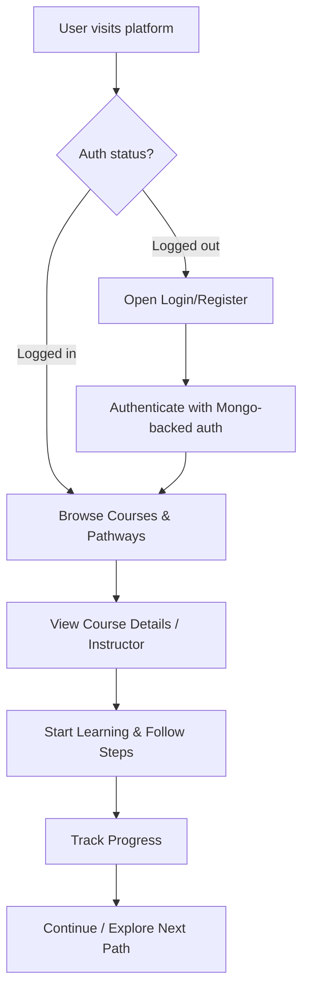

<!-- SkillSphareOnlinePlatform README (custom) -->

<div align="center">

  <h1>SkillSphareOnlinePlatform</h1>
  <p>
    A modern online learning platform built with Next.js, React, Tailwind CSS, and animated UI experiences.
  </p>

  <!-- Animated SVG Header -->
  <svg width="900" height="220" viewBox="0 0 900 220" xmlns="http://www.w3.org/2000/svg" role="img" aria-label="Animated learning workflow">
    <defs>
      <linearGradient id="bgGrad" x1="0" y1="0" x2="1" y2="1">
        <stop offset="0" stop-color="#38B2AC" stop-opacity="0.20" />
        <stop offset="1" stop-color="#8B5CF6" stop-opacity="0.20" />
      </linearGradient>

      <linearGradient id="lineGrad" x1="0" y1="0" x2="1" y2="0">
        <stop offset="0" stop-color="#38B2AC" />
        <stop offset="0.5" stop-color="#60A5FA" />
        <stop offset="1" stop-color="#8B5CF6" />
      </linearGradient>

      <filter id="softGlow" x="-40%" y="-40%" width="180%" height="180%">
        <feGaussianBlur stdDeviation="4" result="blur" />
        <feMerge>
          <feMergeNode in="blur" />
          <feMergeNode in="SourceGraphic" />
        </feMerge>
      </filter>

      <style>
        .floaty { animation: floaty 2.6s ease-in-out infinite; transform-origin: center; }
        @keyframes floaty { 0%,100% { transform: translateY(0px); } 50% { transform: translateY(-6px); } }

        .pulse { animation: pulse 1.8s ease-in-out infinite; transform-origin: center; }
        @keyframes pulse { 0%,100% { opacity: .65; transform: scale(1); } 50% { opacity: 1; transform: scale(1.06); } }

        .dash {
          stroke-dasharray: 8 10;
          animation: dash 2.2s linear infinite;
        }
        @keyframes dash { to { stroke-dashoffset: -180; } }

        .orbit { animation: orbit 3.2s ease-in-out infinite; transform-origin: 450px 110px; }
        @keyframes orbit { 0%,100% { transform: rotate(-8deg); } 50% { transform: rotate(8deg); } }
      </style>
    </defs>

    <!-- Background -->
    <rect x="15" y="15" width="870" height="190" rx="28" fill="url(#bgGrad)" />

    <!-- Nodes -->
    <g filter="url(#softGlow)">
      <g class="floaty">
        <circle cx="165" cy="110" r="24" fill="#38B2AC" opacity="0.95" />
        <circle cx="165" cy="110" r="38" fill="#38B2AC" opacity="0.10" />
      </g>

      <g class="floaty" style="animation-delay: .2s;">
        <circle cx="390" cy="60" r="22" fill="#60A5FA" opacity="0.95" />
        <circle cx="390" cy="60" r="36" fill="#60A5FA" opacity="0.10" />
      </g>

      <g class="floaty" style="animation-delay: .35s;">
        <circle cx="390" cy="160" r="22" fill="#8B5CF6" opacity="0.95" />
        <circle cx="390" cy="160" r="36" fill="#8B5CF6" opacity="0.10" />
      </g>

      <g class="floaty" style="animation-delay: .5s;">
        <circle cx="675" cy="110" r="24" fill="#34D399" opacity="0.95" />
        <circle cx="675" cy="110" r="38" fill="#34D399" opacity="0.10" />
      </g>
    </g>

    <!-- Animated connections -->
    <g class="orbit">
      <path
        d="M 190 110 C 255 110, 315 95, 365 70"
        fill="none"
        stroke="url(#lineGrad)"
        stroke-width="5"
        stroke-linecap="round"
        class="dash"
        opacity="0.95"
      />
      <path
        d="M 190 110 C 255 110, 315 125, 365 150"
        fill="none"
        stroke="url(#lineGrad)"
        stroke-width="5"
        stroke-linecap="round"
        class="dash"
        opacity="0.95"
      />
      <path
        d="M 415 110 C 510 110, 575 110, 651 110"
        fill="none"
        stroke="url(#lineGrad)"
        stroke-width="5"
        stroke-linecap="round"
        class="dash"
        opacity="0.95"
      />
    </g>

    <!-- Tiny orbiting dots -->
    <g class="pulse" style="transform-box: fill-box;">
      <circle cx="235" cy="110" r="6" fill="#38B2AC">
        <animate attributeName="cx" values="190;260;220;190" dur="2.6s" repeatCount="indefinite" />
      </circle>
      <circle cx="390" cy="60" r="5" fill="#60A5FA">
        <animate attributeName="cy" values="60;75;58;60" dur="2.4s" repeatCount="indefinite" />
      </circle>
      <circle cx="390" cy="160" r="5" fill="#8B5CF6">
        <animate attributeName="cy" values="160;145;162;160" dur="2.5s" repeatCount="indefinite" />
      </circle>
    </g>

    <!-- Labels -->
    <g font-family="ui-sans-serif, system-ui, -apple-system, Segoe UI, Roboto, Arial" font-size="14" fill="#0F172A">
      <text x="165" y="150" text-anchor="middle" opacity="0.9" font-weight="700">Discover</text>
      <text x="390" y="35" text-anchor="middle" opacity="0.9" font-weight="700">Learn</text>
      <text x="390" y="195" text-anchor="middle" opacity="0.9" font-weight="700">Practice</text>
      <text x="675" y="150" text-anchor="middle" opacity="0.9" font-weight="700">Improve</text>
    </g>
  </svg>

  <p style="margin-top: 14px;">
    <!-- Badge-style tech chips -->
    
    
    
    
    
    
    
    
  </p>

</div>

---

## About

SkillSphareOnlinePlatform is an online learning platform where users can explore learning paths, view courses and instructors, and track their progress with a clean, responsive, animated interface.

---

## Tech Stack (from `package.json`)

- **Next.js** (16.2.4) — App framework (SSR/SSG + routing)
- **React** (19.2.4) + **React DOM** — UI layer
- **Tailwind CSS** (4) — styling
- **@heroui/react** + **@heroui/styles** — UI components/theme
- **Framer Motion** — animations and motion effects
- **mongodb** — database driver
- **better-auth** + **@better-auth/mongo-adapter** — authentication (Mongo-backed)
- **react-icons** — icon set
- **ESLint** + **eslint-config-next** — linting

---

## Workflow (Project Flow)



---

## Key Features

- Animated, modern UI (Framer Motion + polished layout)
- Course and learning pathway browsing
- Instructor showcase/cards
- Authentication with MongoDB-backed adapter
- Responsive styling via Tailwind CSS + HeroUI

---

## Getting Started

```bash
npm install
npm run dev
```

Then open:
- http://localhost:3000

Build & production start:

```bash
npm run build
npm run start
```

---

## Notes

- The project uses the Next.js App Router (under `src/app/`).
- App styling lives in `src/app/globals.css` and uses Tailwind CSS.

---

## License

Add your license here (e.g., MIT) if needed.
