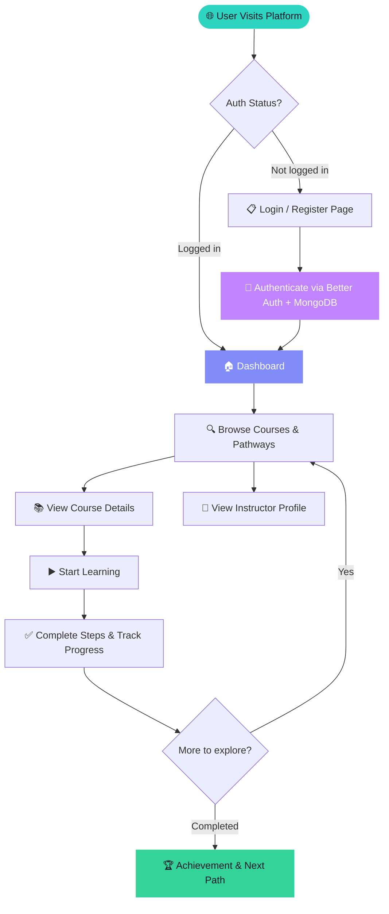

<div align="center">

<!-- Animated Hero Banner -->
<svg width="900" height="260" viewBox="0 0 900 260" xmlns="http://www.w3.org/2000/svg" role="img" aria-label="SkillSphare animated banner">
  <defs>
    <!-- Background mesh gradient -->
    <radialGradient id="mesh1" cx="20%" cy="30%" r="60%">
      <stop offset="0%" stop-color="#0F172A"/>
      <stop offset="100%" stop-color="#0F172A" stop-opacity="0"/>
    </radialGradient>
    <radialGradient id="mesh2" cx="80%" cy="70%" r="55%">
      <stop offset="0%" stop-color="#1E293B"/>
      <stop offset="100%" stop-color="#0F172A" stop-opacity="0"/>
    </radialGradient>
    <linearGradient id="tealPurple" x1="0" y1="0" x2="1" y2="0">
      <stop offset="0%" stop-color="#2DD4BF"/>
      <stop offset="50%" stop-color="#818CF8"/>
      <stop offset="100%" stop-color="#C084FC"/>
    </linearGradient>
    <linearGradient id="tealPurpleV" x1="0" y1="0" x2="0" y2="1">
      <stop offset="0%" stop-color="#2DD4BF"/>
      <stop offset="100%" stop-color="#818CF8"/>
    </linearGradient>
    <filter id="glow" x="-30%" y="-30%" width="160%" height="160%">
      <feGaussianBlur stdDeviation="6" result="blur"/>
      <feMerge><feMergeNode in="blur"/><feMergeNode in="SourceGraphic"/></feMerge>
    </filter>
    <filter id="softBlur" x="-20%" y="-20%" width="140%" height="140%">
      <feGaussianBlur stdDeviation="3" result="blur"/>
      <feMerge><feMergeNode in="blur"/><feMergeNode in="SourceGraphic"/></feMerge>
    </filter>
    <style>
      .hero-title { font-family: ui-monospace, 'Cascadia Code', monospace; font-weight: 900; }
      .hero-sub { font-family: ui-sans-serif, system-ui, sans-serif; }
      .pulse-ring { animation: pulseRing 2.4s ease-in-out infinite; transform-origin: center; }
      @keyframes pulseRing { 0%,100%{opacity:.15;transform:scale(1)} 50%{opacity:.4;transform:scale(1.12)} }
      .float-node { animation: floatNode 3s ease-in-out infinite; }
      @keyframes floatNode { 0%,100%{transform:translateY(0)} 50%{transform:translateY(-8px)} }
      .float-node-2 { animation: floatNode 3.4s ease-in-out infinite .4s; }
      .float-node-3 { animation: floatNode 2.8s ease-in-out infinite .8s; }
      .float-node-4 { animation: floatNode 3.2s ease-in-out infinite .2s; }
      .spin-slow { animation: spinSlow 8s linear infinite; transform-origin: 450px 130px; }
      @keyframes spinSlow { from{transform:rotate(0deg)} to{transform:rotate(360deg)} }
      .dash-flow { stroke-dasharray: 6 8; animation: dashFlow 2s linear infinite; }
      @keyframes dashFlow { to { stroke-dashoffset: -100; } }
      .blink-cursor { animation: blinkCursor 1s step-end infinite; }
      @keyframes blinkCursor { 0%,100%{opacity:1} 50%{opacity:0} }
      .shimmer { animation: shimmer 3s ease-in-out infinite; }
      @keyframes shimmer { 0%,100%{opacity:.6} 50%{opacity:1} }
      .badge-pop { animation: badgePop 4s ease-in-out infinite; }
      @keyframes badgePop { 0%,100%{transform:scale(1)} 50%{transform:scale(1.04)} }
    </style>
  </defs>

  <!-- Dark background -->
  <rect width="900" height="260" rx="20" fill="#0F172A"/>
  <rect width="900" height="260" rx="20" fill="url(#mesh1)"/>
  <rect width="900" height="260" rx="20" fill="url(#mesh2)"/>

  <!-- Grid lines (subtle) -->
  <g opacity="0.04" stroke="#94A3B8" stroke-width="1">
    <line x1="0" y1="65" x2="900" y2="65"/>
    <line x1="0" y1="130" x2="900" y2="130"/>
    <line x1="0" y1="195" x2="900" y2="195"/>
    <line x1="225" y1="0" x2="225" y2="260"/>
    <line x1="450" y1="0" x2="450" y2="260"/>
    <line x1="675" y1="0" x2="675" y2="260"/>
  </g>

  <!-- Orbiting ring decoration -->
  <g class="spin-slow" opacity="0.08">
    <ellipse cx="450" cy="130" rx="220" ry="80" fill="none" stroke="url(#tealPurple)" stroke-width="1.5" stroke-dasharray="4 8"/>
  </g>

  <!-- Floating corner orbs -->
  <circle cx="80" cy="80" r="55" fill="#2DD4BF" opacity="0.04" class="pulse-ring"/>
  <circle cx="820" cy="180" r="65" fill="#C084FC" opacity="0.04" class="pulse-ring" style="animation-delay:.8s"/>
  <circle cx="820" cy="180" r="38" fill="#C084FC" opacity="0.06"/>
  <circle cx="80" cy="80" r="32" fill="#2DD4BF" opacity="0.08"/>

  <!-- Left node cluster -->
  <g class="float-node" filter="url(#softBlur)">
    <circle cx="110" cy="130" r="30" fill="#2DD4BF" opacity="0.12"/>
    <circle cx="110" cy="130" r="16" fill="#2DD4BF" opacity="0.9"/>
    <text x="110" y="135" text-anchor="middle" font-size="11" fill="#0F172A" font-weight="800" font-family="monospace">⚡</text>
  </g>

  <!-- Right node cluster -->
  <g class="float-node-4" filter="url(#softBlur)">
    <circle cx="790" cy="130" r="30" fill="#C084FC" opacity="0.12"/>
    <circle cx="790" cy="130" r="16" fill="#C084FC" opacity="0.9"/>
    <text x="790" y="135" text-anchor="middle" font-size="11" fill="#0F172A" font-weight="800" font-family="monospace">🏆</text>
  </g>

  <!-- Top-mid node -->
  <g class="float-node-2" filter="url(#softBlur)">
    <circle cx="310" cy="62" r="22" fill="#818CF8" opacity="0.15"/>
    <circle cx="310" cy="62" r="12" fill="#818CF8" opacity="0.9"/>
  </g>

  <!-- Bottom-mid node -->
  <g class="float-node-3" filter="url(#softBlur)">
    <circle cx="590" cy="198" r="22" fill="#34D399" opacity="0.15"/>
    <circle cx="590" cy="198" r="12" fill="#34D399" opacity="0.9"/>
  </g>

  <!-- Connecting dashed lines -->
  <path d="M126 130 Q220 90 298 68" fill="none" stroke="url(#tealPurple)" stroke-width="1.5" class="dash-flow" opacity="0.5"/>
  <path d="M322 68 Q390 55 450 130" fill="none" stroke="url(#tealPurple)" stroke-width="1.5" class="dash-flow" opacity="0.5" style="animation-delay:.4s"/>
  <path d="M450 130 Q520 205 578 196" fill="none" stroke="url(#tealPurple)" stroke-width="1.5" class="dash-flow" opacity="0.5" style="animation-delay:.8s"/>
  <path d="M602 196 Q696 200 774 138" fill="none" stroke="url(#tealPurple)" stroke-width="1.5" class="dash-flow" opacity="0.5" style="animation-delay:1.2s"/>

  <!-- Main title -->
  <text x="450" y="108" text-anchor="middle" class="hero-title shimmer" font-size="44" fill="url(#tealPurple)" filter="url(#glow)" letter-spacing="1">SkillSphare</text>

  <!-- Subtitle with cursor -->
  <text x="450" y="148" text-anchor="middle" class="hero-sub" font-size="15" fill="#94A3B8" letter-spacing="2">ONLINE LEARNING PLATFORM</text>

  <!-- Bottom tagline -->
  <text x="450" y="198" text-anchor="middle" font-family="ui-monospace, monospace" font-size="12" fill="#475569">
    <tspan fill="#2DD4BF">&gt; </tspan>
    <tspan fill="#CBD5E1">Discover. Learn. Practice. Improve</tspan>
    <tspan class="blink-cursor" fill="#2DD4BF">_</tspan>
  </text>

  <!-- Bottom accent line -->
  <rect x="160" y="222" width="580" height="2" rx="1" fill="url(#tealPurple)" opacity="0.5" class="shimmer"/>
</svg>

<br/>

<p>
  <a href="#"></a>
  <a href="#"></a>
  <a href="#"></a>
  <a href="#"></a>
  <a href="#"></a>
  <a href="#"></a>
  <a href="#"></a>
  <a href="#"></a>
</p>

<p>
  
  
  
  
</p>

</div>

---

## 📖 About

**SkillSphare** is a modern, full-stack online learning platform where learners can explore curated learning paths, browse detailed course catalogs, discover skilled instructors, and track their progress — all wrapped in a buttery-smooth, animated interface.

Built with the latest Next.js App Router, styled with Tailwind CSS v4, and animated with Framer Motion, SkillSphare is designed to feel as good as it looks.

---

## ✨ Features

<!-- Feature grid using HTML table for GitHub README -->
<div align="center">

| 🎯 Core | 🎨 Design | 🔐 Auth & Data |
|---|---|---|
| Course catalog & browsing | Animated UI with Framer Motion | MongoDB-backed authentication |
| Curated learning pathways | Responsive layout (mobile-first) | Session management via Better Auth |
| Instructor profile cards | Dark/light theme support | Secure API routes with Next.js |
| Progress tracking dashboard | Smooth page transitions | Mongo adapter for user data |
| Step-by-step course flow | HeroUI component library | Environment-based config |

</div>

---

## 🗂️ Project Structure

```
SkillSphareOnlinePlatform/
├── src/
│   ├── app/                    # Next.js App Router
│   │   ├── (auth)/             # Auth routes (login, register)
│   │   ├── (dashboard)/        # Protected dashboard routes
│   │   ├── courses/            # Course catalog & detail pages
│   │   ├── pathways/           # Learning pathway pages
│   │   ├── instructors/        # Instructor showcase
│   │   ├── globals.css         # Global styles (Tailwind v4)
│   │   └── layout.tsx          # Root layout
│   ├── components/             # Reusable UI components
│   │   ├── ui/                 # Base components (cards, buttons…)
│   │   ├── courses/            # Course-specific components
│   │   └── layout/             # Header, footer, sidebar
│   ├── lib/                    # Utilities & helpers
│   │   ├── auth.ts             # Better Auth configuration
│   │   └── db.ts               # MongoDB connection
│   └── types/                  # TypeScript type definitions
├── public/                     # Static assets
├── .env.local                  # Environment variables (not committed)
├── next.config.ts              # Next.js configuration
├── tailwind.config.ts          # Tailwind CSS configuration
└── package.json
```

---

## 🔄 App Workflow



---

## 🛠️ Tech Stack

| Layer | Technology | Purpose |
|---|---|---|
| **Framework** | Next.js 15 (App Router) | SSR, SSG, routing, API routes |
| **UI Library** | React 19 | Component-based UI |
| **Styling** | Tailwind CSS v4 | Utility-first responsive styling |
| **Components** | HeroUI + HeroUI Styles | Pre-built, themed UI components |
| **Animation** | Framer Motion | Page transitions & micro-interactions |
| **Database** | MongoDB | Course data, users, progress |
| **Auth** | Better Auth + Mongo Adapter | Session management, OAuth |
| **Icons** | React Icons | Scalable icon set |
| **Linting** | ESLint + eslint-config-next | Code quality & consistency |

---

## 🚀 Getting Started

### Prerequisites

- **Node.js** `>= 18.x`
- **npm** `>= 9.x` (or `pnpm` / `yarn`)
- **MongoDB** instance (local or [MongoDB Atlas](https://www.mongodb.com/cloud/atlas))

### 1. Clone the repository

```bash
git clone https://github.com/your-username/SkillSphareOnlinePlatform.git
cd SkillSphareOnlinePlatform
```

### 2. Install dependencies

```bash
npm install
```

### 3. Configure environment variables

Create a `.env.local` file in the root directory:

```env
# MongoDB
MONGODB_URI=mongodb+srv://<username>:<password>@cluster.mongodb.net/skillsphare

# Better Auth
BETTER_AUTH_SECRET=your-secret-key-here
BETTER_AUTH_URL=http://localhost:3000

# Optional: OAuth Providers
GITHUB_CLIENT_ID=your-github-client-id
GITHUB_CLIENT_SECRET=your-github-client-secret
GOOGLE_CLIENT_ID=your-google-client-id
GOOGLE_CLIENT_SECRET=your-google-client-secret
```

### 4. Run the development server

```bash
npm run dev
```

Open [http://localhost:3000](http://localhost:3000) in your browser. 🎉

---

## 📦 Build & Deploy

```bash
# Production build
npm run build

# Start production server
npm run start

# Lint check
npm run lint
```

### Deploy to Vercel (Recommended)

[](https://vercel.com/new)

1. Push your repository to GitHub
2. Import the project on [Vercel](https://vercel.com)
3. Add your environment variables in the Vercel dashboard
4. Deploy — Vercel auto-detects Next.js and handles the rest

---

## 🎨 Design System

SkillSphare uses a cohesive design system built on top of Tailwind CSS and HeroUI:

- **Primary color**: Teal (`#2DD4BF`) — action, links, progress
- **Accent color**: Indigo (`#818CF8`) — highlights, badges
- **Success color**: Emerald (`#34D399`) — completion states
- **Backgrounds**: Dark slate (`#0F172A` / `#1E293B`) with light mode support
- **Typography**: System sans-serif stack with `ui-monospace` for code elements
- **Motion**: Spring-based animations via Framer Motion for all transitions

---

## 🤝 Contributing

Contributions are very welcome!

1. **Fork** the repository
2. **Create** a feature branch: `git checkout -b feature/amazing-feature`
3. **Commit** your changes: `git commit -m 'feat: add amazing feature'`
4. **Push** to your branch: `git push origin feature/amazing-feature`
5. **Open** a Pull Request

Please ensure your code passes ESLint checks (`npm run lint`) before submitting.

---

## 🗺️ Roadmap

- [ ] 🎥 Video player integration for course lessons
- [ ] 💬 Discussion forums per course
- [ ] 📊 Advanced analytics dashboard for instructors
- [ ] 🏅 Certificates & badges on course completion
- [ ] 🌐 Internationalization (i18n) support
- [ ] 📱 Native mobile app (React Native)
- [ ] 🤖 AI-powered course recommendations
- [ ] 💳 Stripe payment integration for premium content

---

## 📄 License

This project is licensed under the **MIT License** — see the [LICENSE](LICENSE) file for details.

---

<div align="center">

<!-- Animated footer SVG -->
<svg width="700" height="70" viewBox="0 0 700 70" xmlns="http://www.w3.org/2000/svg">
  <defs>
    <linearGradient id="footerGrad" x1="0" y1="0" x2="1" y2="0">
      <stop offset="0%" stop-color="#2DD4BF" stop-opacity="0"/>
      <stop offset="30%" stop-color="#2DD4BF"/>
      <stop offset="70%" stop-color="#818CF8"/>
      <stop offset="100%" stop-color="#C084FC" stop-opacity="0"/>
    </linearGradient>
    <style>
      .footer-pulse { animation: footerPulse 3s ease-in-out infinite; }
      @keyframes footerPulse { 0%,100%{opacity:.4} 50%{opacity:1} }
      .footer-dot { animation: footerDot 2s ease-in-out infinite; }
      @keyframes footerDot { 0%,100%{transform:scale(1)} 50%{transform:scale(1.5)} }
    </style>
  </defs>
  <rect x="0" y="28" width="700" height="1.5" rx="1" fill="url(#footerGrad)" class="footer-pulse"/>
  <circle cx="350" cy="28.75" r="5" fill="#818CF8" class="footer-dot"/>
  <circle cx="310" cy="28.75" r="3" fill="#2DD4BF" class="footer-dot" style="animation-delay:.3s"/>
  <circle cx="390" cy="28.75" r="3" fill="#C084FC" class="footer-dot" style="animation-delay:.6s"/>
  <text x="350" y="58" text-anchor="middle" font-family="ui-monospace, monospace" font-size="11" fill="#64748B">Built with ❤️ using Next.js · React · Tailwind CSS · MongoDB</text>
</svg>

<br/>

⭐ **Star this repo** if you find it helpful!

</div>